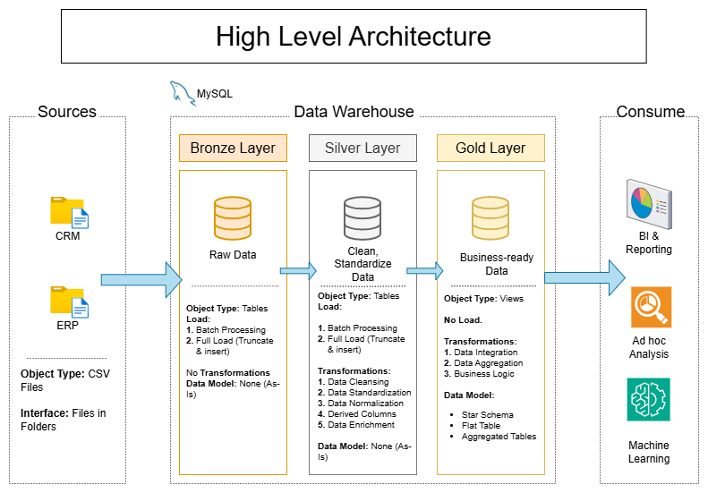
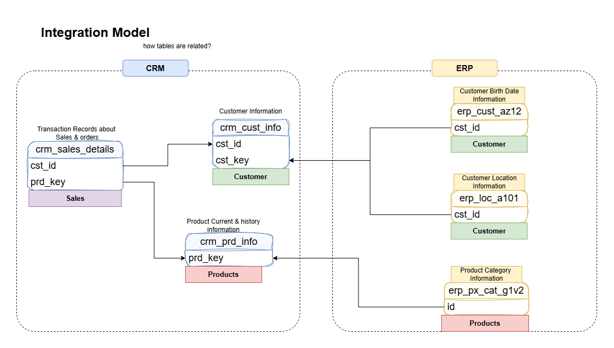
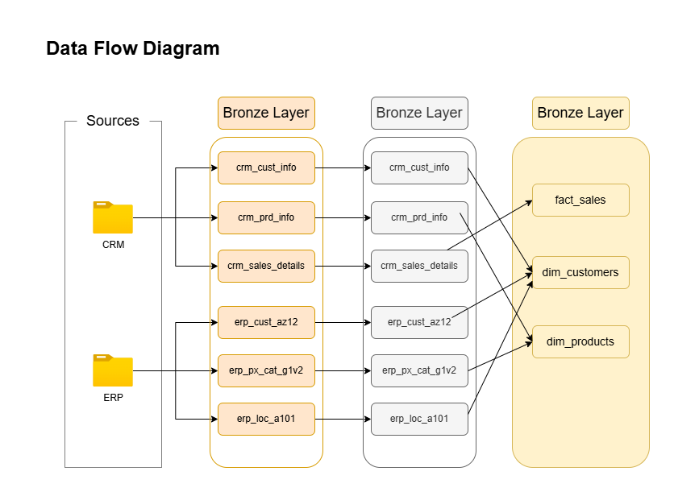
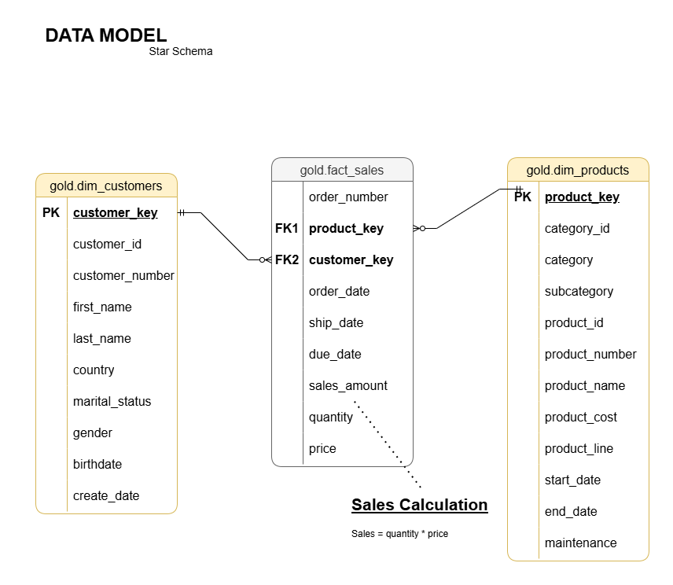

# Data Warehouse And Analytics Project
# Project Requirements

### 1. Building Data Warehouse
Design and Develop Data Warehouse system that integrate data from two sources.

### 2. BI: Analytics and Reporting
Perform Comprehensive Analysis on Data and extract insights.

# Tools 
<ol>
<li>MySql</li>
<li>Python</li>
<li>Draw.io</li>
<li>Notion</li>
<li>GitHub 😉</li>
</ol> 

# Data Warehouse Architecture
This Project uses Medallion Architecture. 

# Data Integration Model
This model vizualizes how given tables are connected to each other and use to build new data model. I also categorizes each table as a dimension or a fact .Here, customer and products are dimension and sales are fact.

# Data Flow Diagram
The data flow from folders files to bronze Layer then we clean and transform data and move clean data to silver layer and finaly uses the star schema data model where we combine relevant tabels into fact or dimensions depending on tables characteristics.

# Data Model

# Exploratory Data Analysis (EDA)
After building data warehouse I move towards EDA where I explore business objects and answer several questions to get sense of my data. The script used to perform EDA is present in `data_analytics_scripts` directory.

# Advance Data Analytics
Last but not the least, I move towards answering business relevant complex questions where I perform several types of Analysis. e.g
 
<ol>
<li>Time Series Analysis</li>
<li>Cumulative Analysis</li>
<li>Part to whole (Proportional Analysis)</li>
<li>Data Segmentation</li>
</ol> 

I try to answer complex questions using these types of analysis. At last, I move towards creating two reports to provide an overview at a glance of important business objects (customers and products).

# Conclusion
This project is a greate learning experience for me where I learn how to plan,execute and finish. 

